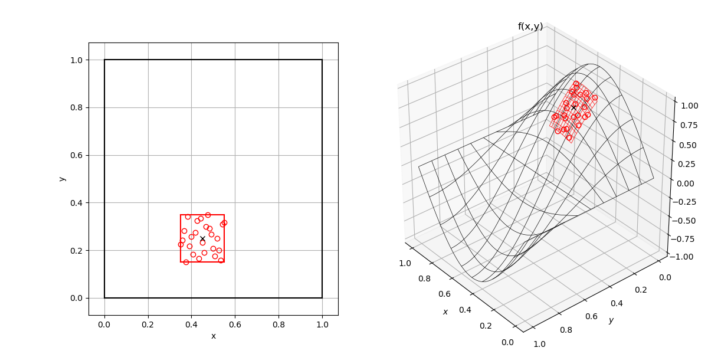
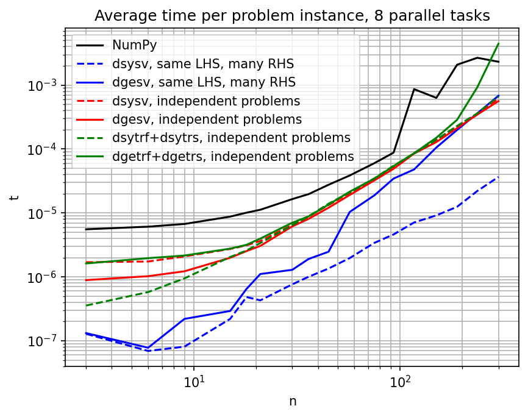

# wlsqm


[](http://makeapullrequest.com/)

We use [semantic versioning](https://semver.org/).

For my stance on AI contributions, see the [collaboration guidelines](https://github.com/Technologicat/substrate-independent/blob/main/collaboration.md).




## Introduction

The `wlsqm` Python library is a fast and accurate weighted least squares meshless interpolator and differentiator.

The WLSQM (Weighted Least SQuares Meshless) method constructs a piecewise polynomial surrogate model on scattered data. Given scalar values at a point cloud in 1D, 2D, or 3D, this library fits a local polynomial (up to 4th order) in the neighborhood of each data point, by weighted least squares. From the surrogate model, you can read off the function value and any derivative up to the polynomial order, at the fit origin (each data point) or anywhere inside the local neighborhood.

Use cases:

- **Numerical differentiation** of data known only as values at discrete points. Applies to explicit algorithms for IBVPs: compute a gradient or Laplacian on a scattered point cloud without needing a mesh.
- **Response-surface modeling** on an unstructured set of design points.
- **Smoothing noisy function values** — the averaging effect of the least-squares fit denoises first derivatives significantly.
  - Second derivatives are more sensitive to noise; for those, the robust recipe is to run WLSQM once to recover first derivatives on the neighborhood, then run it again on those to get second derivatives.

No grid or mesh is needed. The only restriction on geometry is non-degeneracy — e.g. 2D points must not all fall on the same 1D line.

### Not a Taylor series

Despite the storage layout looking like the coefficients of a Taylor expansion (slots for `f`, `df/dx`, `df/dy`, `d²f/dx²`, ..., indexed by monomial degree), the WLSQM method is **not** derived from a Taylor series.

The polynomial is fitted over a local neighborhood of data points by weighted least squares. The coefficients come from a linear solve, not from differentiating an analytic function at the origin. The error behavior is correspondingly much better than Taylor truncation error would predict, thanks to the averaging effect of the least-squares fit.

In a sense, we may even say that there *is no underlying function* that is being modeled. The only thing that exists before the fitting are the data values on a set of points. Whether or not these data values come from a differentiable function — or are just arbitrary numerical data — is immaterial.

This method appears in the literature under several names: MLS (moving least squares), WLSQM (weighted least squares meshless/meshfree), "diffuse approximation." These are essentially the same idea with varying weighting function choices.

### Origin of this variant of the method

This is an independent implementation of the algorithm described (in the 2nd-order 2D case) in section 2.2.1 of Hong Wang (2012), *Evolutionary Design Optimization with Nash Games and Hybridized Mesh/Meshless Methods in Computational Fluid Dynamics*, Jyväskylä Studies in Computing 162, University of Jyväskylä. [ISBN 978-951-39-5007-1 (PDF)](http://urn.fi/URN:ISBN:978-951-39-5007-1)

Full derivation of the generalized version (including the case of unknown function values, and the accuracy analysis) can be found in this repository, in [`doc/wlsqm_gen.pdf`](doc/wlsqm_gen.pdf).


## Features

- **1D / 2D / 3D point clouds**, polynomials of order 0 through 4.
- **Any derivative** up to the polynomial order is available: at the fit origin as a DOF of the linear solve, and at any point inside the neighborhood via the interpolator.
  - Differentiation of the basis polynomials is hardcoded for speed.
- **Knowns.** At the fit origin, any subset of `{f, ∂f/∂x, ∂f/∂y, ∂²f/∂x², …}` can be marked as known.
  - The known DOFs are eliminated algebraically, shrinking the linear system to just the unknowns.
  - The function value itself may be unknown at some of the data points — this is useful e.g. for Neumann boundary conditions in a PDE solver.
- **Weighting methods.**
  - `WEIGHT_UNIFORM` weights all data points equally in each local neighborhood.
  - `WEIGHT_CENTER` emphasizes points near the fit origin (each data point), improving derivative estimates there at the cost of fit quality far from the origin (of that neighborhood).
- **Sensitivity data.** Solution DOFs can be optionally differentiated w.r.t. the input function values, so you know how the output moves when the input wiggles.
- **Expert mode with separate prepare and solve stages.**
  - If many fits share the same geometry but have different function-value data, `ExpertSolver.prepare()` generates and LU-factors the problem matrices once, and `solve()` can then be called many times with different `fk`.
  - This is the fast path for time-stepping an IBVP over a fixed point cloud.
- **Parallel across independent local problems.**
  - `fit_*_many_parallel` and `ExpertSolver(ntasks=N)` run independent fits across OpenMP threads. The linear-solver step is also parallel across the problem instances.
- **Speed.**
  - Performance-critical code is in Cython with the GIL released.
  - LAPACK is called directly via [SciPy's Cython-level bindings](https://docs.scipy.org/doc/scipy/reference/linalg.cython_lapack.html); no GIL round-trip for the solver loop.
  - For asymptotic timings of the parallel batched LAPACK drivers vs. a Python loop over `numpy.linalg.solve`, see the figure under "Performance" below.
- **Accuracy.**
  - Problem matrices are preconditioned by a symmetry-preserving iterative scaling (Ruiz, 2001) before LU factorization, which is critical for high-order fits.
    - Reference: Daniel Ruiz. 2001. *A Scaling Algorithm to Equilibrate Both Rows and Columns Norms in Matrices*. Report RAL-TR-2001-034.
  - The polynomial evaluator uses a custom symmetric form that is a natural multidimensional extension of the standard Horner form.
    - Evaluation uses fused multiply-add (`fma`), thus rounding only once per accumulation step.
    - For details, see [`wlsqm/fitter/polyeval.pyx`](wlsqm/fitter/polyeval.pyx).
  - Optional iterative refinement inside the solver mitigates roundoff further.


## Performance



Average time per problem instance for the parallel LAPACK drivers in `wlsqm.utils.lapackdrivers`, on a synthetic batch of independent symmetric and general linear systems of varying matrix size `n`. Generated by [`examples/lapackdrivers_example.py`](examples/lapackdrivers_example.py) (seeded RNG, deterministic). Both axes are log scale.

The takeaway is that the batched parallel drivers (red and green lines) cost a small fraction of what a Python loop calling `numpy.linalg.solve` (black line) costs per instance — most of the savings come from staying inside `nogil` Cython for the loop and from OpenMP parallelism over independent problems. The factorize-once-then-solve pair (green) is essentially as fast as the single-shot solver (red) when the batch is solved exactly once, and pays off when the same factorization is reused against many right-hand sides.

To regenerate the figure on your own machine:

```bash
python examples/lapackdrivers_example.py
```

The script writes both `lapack_timings.png` and `lapack_timings.pdf` to the project root.


## Examples

Minimal example using a manufactured solution to produce the input data: fit `f(x,y) = 1 + 2x + 3y + 4xy + 5x² + 6y²` on a scattered point cloud centered at the origin.

```python
import numpy as np
import wlsqm

# seed the RNG for reproducibility
rng = np.random.default_rng(42)

# point cloud
xk = rng.uniform(-1.0, 1.0, size=(30, 2))

# data values on the point cloud
fk = 1 + 2*xk[:,0] + 3*xk[:,1] + 4*xk[:,0]*xk[:,1] + 5*xk[:,0]**2 + 6*xk[:,1]**2

# point(s) where to evaluate the fit [[x0, y0], [x1, y1], ...]
xi = np.array([0.0, 0.0])

# output array for the fit
fi = np.zeros(wlsqm.number_of_dofs(2, 2))  # (number_of_dimensions, polynomial_order)

wlsqm.fit_2D(
    xk=xk, fk=fk, xi=xi, fi=fi,
    sens=None, do_sens=False,
    order=2, knowns=0,
    weighting_method=wlsqm.WEIGHT_UNIFORM,
    debug=False,
)

# fi now holds the partial derivatives at (0, 0).
# The ordering is [f, ∂f/∂x, ∂f/∂y, ∂²f/∂x², ∂²f/∂x∂y, ∂²f/∂y²].
print(fi)
```

For this exact polynomial, the fit recovers `[1, 2, 3, 10, 4, 12]` to machine precision.

For a comprehensive tour of the API, see [`examples/wlsqm_example.py`](examples/wlsqm_example.py).

For a minimal `ExpertSolver` example that demonstrates the prepare/solve separation, see [`examples/expertsolver_example.py`](examples/expertsolver_example.py).


## Installation

### From PyPI

```bash
pip install wlsqm
```

Pre-built wheels are available for Linux, macOS, and Windows, for Python 3.11–3.14. Parallel OpenMP is enabled in all published wheels:

- **Linux:** GCC's `libgomp` via manylinux.
- **macOS:** LLVM's `libomp` (from conda-forge) bundled into the wheel by `delocate-wheel`.
- **Windows:** MSVC's `vcomp140.dll`, which ships with every Python-for-Windows install.

### From source

```bash
git clone https://github.com/Technologicat/python-wlsqm.git
cd python-wlsqm
pip install .
```

For maximum performance on your specific machine, build with architecture-specific optimizations:

```bash
CFLAGS="-march=native" pip install --no-build-isolation .
```

PyPI wheels use generic `-O2` because `-march=native` bakes the build machine's instruction set into the binary — a wheel built with AVX-512 would crash on a CPU without it. Building from source avoids that and lets the compiler target your specific hardware.

### macOS: OpenMP for source builds

macOS's Apple Clang does not ship an OpenMP runtime. For a source install to produce a parallel build, install `libomp` first:

```bash
brew install libomp
pip install --no-binary wlsqm --no-build-isolation wlsqm
```

Without `libomp`, the source build fails at compile time because Cython's `cimport openmp` in the source emits `#include <omp.h>`. The published wheels from PyPI already bundle their own `libomp.dylib` via `delocate-wheel`, so `pip install wlsqm` (without `--no-binary`) works on macOS regardless of whether you have Homebrew's libomp.

### Development setup

Uses [meson-python](https://meson-python.readthedocs.io/) as the build backend and [PDM](https://pdm-project.org/) for dependency management:

```bash
git clone https://github.com/Technologicat/python-wlsqm.git
cd python-wlsqm
pdm config venv.in_project true
pdm use 3.14                             # or whichever Python you prefer
pdm install                              # creates .venv, installs dev deps
export PATH="$(pwd)/.venv/bin:$PATH"     # or $(pdm venv activate) — meson and ninja must be on PATH
pip install --no-build-isolation -e .    # editable install
```

After editing a `.pyx` or `.pxd` file, the next `import wlsqm` auto-rebuilds the changed extension. No manual reinstall needed.

`--no-build-isolation` is required for editable installs with meson-python: the on-import rebuild mechanism needs Cython, NumPy, meson, and ninja to remain available in the venv, not just in a throwaway PEP 517 overlay.

### Running the tests

```bash
pdm run pytest tests/ -v
```

As of v1.0.0, the test suite has 57 tests covering:

- polynomial recovery (1D/2D/3D, order 0–4),
- `ExpertSolver` prepare/solve round-trips,
- interpolation accuracy,
- `_many_parallel` ≡ `_many` (serial) equivalence,
- classical finite-difference-stencil equivalence on non-polynomial inputs (sin, exp, Gaussian, …),
- first-derivative robustness to Gaussian noise,
- the LAPACK driver layer, and
- `.pxd` install verification.


## Documentation

- **API:** docstrings in [`wlsqm/fitter/simple.pyx`](wlsqm/fitter/simple.pyx) (simple API) and [`wlsqm/fitter/expert.pyx`](wlsqm/fitter/expert.pyx) (`ExpertSolver`).
- **Examples:** [`examples/wlsqm_example.py`](examples/wlsqm_example.py) for the full tour, [`examples/expertsolver_example.py`](examples/expertsolver_example.py) for `ExpertSolver` specifically.
- **Theory PDFs** in [`doc/`](doc/):
  - [`wlsqm_gen.pdf`](doc/wlsqm_gen.pdf) — the generalized version implemented in `wlsqm`, including the case of unknown function values, the accuracy analysis, and why WLSQM works.
  - [`wlsqm.pdf`](doc/wlsqm.pdf) — older writeup, plus the sensitivity calculation.
  - [`eulerflow.pdf`](doc/eulerflow.pdf) — application example in compressible flow, with a cleaner presentation of the original version.

See [TODO.md](TODO.md) for known gaps in the theory PDFs.


## Dependencies

- [NumPy](http://www.numpy.org) ≥ 1.25
- [SciPy](http://www.scipy.org) ≥ 1.9 (both build-time for `cython_lapack` and runtime)
- [Cython](http://www.cython.org) ≥ 3.0 (build-time only)
- OpenMP (build-time; see platform notes above)

Requires Python ≥ 3.11.


## License

[BSD 2-Clause](LICENSE.md). Copyright 2016–2026 Juha Jeronen, University of Jyväskylä, and JAMK University of Applied Sciences.


#### Acknowledgement

The original version of this work, in 2016–2017, was financially supported by the Jenny and Antti Wihuri Foundation.
